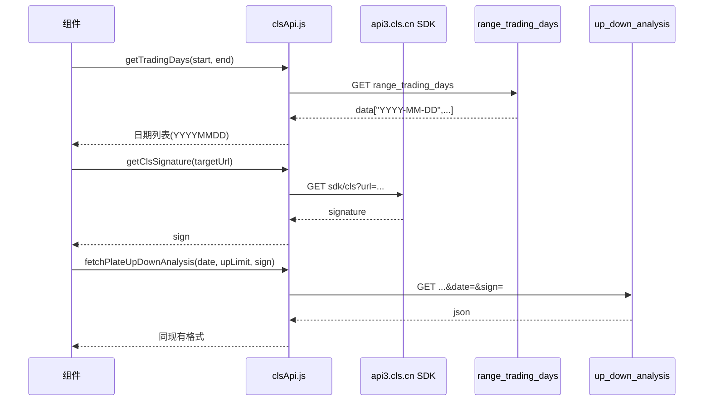

# CLS 接口改造计划

## 现状与目标

**当前逻辑：**

- 直接用 `https://x-quote.cls.cn/v2/quote/a/plate/up_down_analysis?up_limit=1&date=YYYYMMDD` 经 corsproxy 请求，无签名。
- 日期用「往前推、跳过周末」本地推算。

**新逻辑：**

1. 通过 SDK 获取签名：`GET https://api3.cls.cn/v2/js/sdk/cls?url=...` → 使用返回的 `data.signature` 作为 `sign` 参数。
2. 通过 `range_trading_days` 获取可查询交易日：`GET https://x-quote.cls.cn/v2/quote/a/stock/range_trading_days?start_date=YYYY-MM-DD&end_date=YYYY-MM-DD` → 使用 `data` 数组（格式 `["YYYY-MM-DD", ...]`）。
3. 请求数据时在 URL 上带 `&sign=xxx`：`https://x-quote.cls.cn/v2/quote/a/plate/up_down_analysis?up_limit=1&date=YYYYMMDD&sign=xxx`。

**SDK 实测返回示例：**

```json
{"errno":0,"msg":"","data":{"signature":"3f711f40...","url":"https://api3.cls.cn/share/quote/analysis?os=ios",...}}
```

**需确认点：** 签名是否按「请求 URL」生成。若 x-quote 校验的是「当前请求 URL 的签名」，则 SDK 的 `url` 参数应传我们实际要请求的完整 URL（例如 `https://x-quote.cls.cn/v2/quote/a/plate/up_down_analysis?up_limit=1&date=20260313`），再用返回的 `signature` 作为 `sign`。若接口文档有说明，以文档为准；否则先按「按目标 URL 取 sign」实现，失败再试固定 url 取 sign。

---

## 涉及的功能与文件


| 功能           | 文件                                                                     | 当前用法                                       |
| ------------ | ---------------------------------------------------------------------- | ------------------------------------------ |
| 板块排名（近 20 日） | [src/components/PlateRanking.vue](src/components/PlateRanking.vue)     | 本地循环跳过周末，对每个日期请求 up_down_analysis，有 DB 缓存  |
| 板块轮动（近 7 日）  | [src/components/SectorRotation.vue](src/components/SectorRotation.vue) | 同上，取 7 个有效日，有 DB 缓存                        |
| 个股/板块分析（单日）  | [src/components/StockAnalysis.vue](src/components/StockAnalysis.vue)   | 用户选日期，请求 up_down_analysis（支持 up_limit=0/1） |
| 旧版板块轮动（疑似未用） | [src/SectorRotation.vue](src/SectorRotation.vue)                       | 同上，无 DB，直接 7 日请求                           |


路由实际使用的是 `src/components/SectorRotation.vue`（见 [App.vue](src/App.vue)）；`src/SectorRotation.vue` 若确认无引用可考虑删除或标注废弃。

---

## 实现方案

### 1. 新增统一请求层：`src/utils/clsApi.js`

- **getClsSignature(targetRequestUrl)**  
  - 请求：`https://api3.cls.cn/v2/js/sdk/cls?url=${encodeURIComponent(targetRequestUrl)}`（若后端要求对 x-quote 签名，则 `targetRequestUrl` 为将要请求的完整 up_down_analysis URL；否则可为文档中给出的固定 url）。  
  - 解析 JSON，校验 `errno === 0`，返回 `data.signature`。  
  - 可选：短期内存缓存（如 5 分钟内同一 URL 复用同一 signature），减少重复请求。
- **getTradingDays(startDate, endDate)**  
  - 参数：`startDate`、`endDate` 为 `YYYY-MM-DD`。  
  - 请求：`https://x-quote.cls.cn/v2/quote/a/stock/range_trading_days?start_date=...&end_date=...`。  
  - 若需走代理：可在此处统一用 corsproxy 或你方现有代理。  
  - 返回：`data` 数组，并将元素转为 `YYYYMMDD` 供 up_down_analysis 使用（或直接返回 YYYYMMDD 数组）。
- **fetchPlateUpDownAnalysis(options)**  
  - 参数：`{ date, upLimit, signature }`（`date` 为 YYYYMMDD，`upLimit` 为 0 或 1，`signature` 来自 `getClsSignature`）。  
  - 拼 URL：`https://x-quote.cls.cn/v2/quote/a/plate/up_down_analysis?up_limit=${upLimit}&date=${date}&sign=${signature}`。  
  - 若浏览器仍有 CORS 限制，可在此方法内继续使用 corsproxy 包装上述 URL 再 fetch。  
  - 返回：与当前一致的 `json`（含 `code`、`data.plate_stock` 等），便于各组件不改动后续处理逻辑。

**错误处理：** 对 SDK、range_trading_days、up_down_analysis 的 fetch 和 json 解析做 try/catch，统一抛出或返回带 message 的 Error，便于上层展示「接口错误」或回退到本地缓存/DB。

### 2. DB 与请求策略（按是否当天区分）

- **当天数据（date === 今天 YYYYMMDD）**  
  - **不读 DB**：直接请求接口（getClsSignature → fetchPlateUpDownAnalysis）。  
  - 请求成功后**写入/更新 DB**（extractAndSaveAllData），保证本地存的是最新当天数据。
- **非当天数据**  
  - **先查 DB**：有数据则直接用 DB 结果，不再请求接口。  
  - **无数据再请求接口**：请求成功后写入 DB，与现有逻辑一致。

组件侧判断方式：用 `date === getTodayYYYYMMDD()`（或等价）区分「当天」与「历史日」；同一套 getTradingDays / getPlateData / fetchPlateUpDownAnalysis 流程内按上述分支执行即可。

### 3. 日期策略：优先用 `range_trading_days`，可保留回退逻辑

- **PlateRanking（近 20 个交易日）、SectorRotation（近 7 个交易日）**  
  - 用 `getTradingDays(endDate, startDate)`（或按接口要求顺序）拿到一段区间内的交易日，取「最近 N 个」作为要请求的日期列表。  
  - 若 `range_trading_days` 失败，可回退到当前「往前推 + 跳过周末」逻辑，保证弱网或接口异常时仍能部分可用。
- **StockAnalysis（单日）**  
  - 用户选择日期后，可先校验该日是否在「最近一次 range_trading_days 结果」中（可选）；若不做校验，直接带 sign 请求 up_down_analysis 即可，由接口返回错误时再提示。

### 4. 各组件改动要点

- **[PlateRanking.vue](src/components/PlateRanking.vue)**（约 92–166 行）  
  - 先调 `getTradingDays` 得到最近 20 个交易日的 YYYYMMDD。  
  - 对每个日期：**若为当天** → 不读 DB，直接请求接口，成功后 `extractAndSaveAllData` 写库并填充 `dateData`。**若为非当天** → 先查 DB，有则用 DB 并填充；无则请求接口，成功后写库并填充。  
  - 可对同一次加载的多个日期共用一个 signature（若接口允许）。
- **[SectorRotation.vue](src/components/SectorRotation.vue)**（约 365–426 行）  
  - 用 `getTradingDays` 取最近 7 个交易日。对每个日期：**当天**不读 DB、直接请求并写库；**非当天**先读 DB，无再请求并写库。
- **[StockAnalysis.vue](src/components/StockAnalysis.vue)**（约 29–72 行）  
  - **选中日期为当天**：不读 DB，直接 getClsSignature → fetchPlateUpDownAnalysis，成功后写缓存与 DB 并更新界面。**选中日期非当天**：先查 DB/缓存，有则用；无则请求接口，成功后写缓存与 DB。
- **src/SectorRotation.vue**  
  - 与 components 版对齐（getTradingDays + 当天/非当天 DB 策略 + fetchPlateUpDownAnalysis）；若确认未引用可删除或废弃。

### 5. CORS / 代理

- 若 `api3.cls.cn`、`x-quote.cls.cn` 在浏览器仍有 CORS 限制，可在 `clsApi.js` 内对上述三个请求统一加一层 corsproxy（或你方代理），例如：  
`fetch('https://corsproxy.io/?' + encodeURIComponent(actualUrl))`。  
- 这样组件只依赖 `clsApi.js`，不关心是否走代理。

### 6. 数据流概览




---

## 建议实施顺序

1. 实现 `clsApi.js`（getClsSignature、getTradingDays、fetchPlateUpDownAnalysis），并用控制台或单页测试：先测 range_trading_days，再测「取 sign + 带 sign 请求 up_down_analysis」是否返回 200 且数据正常。
2. 若签名必须按「当前请求 URL」生成，在 getClsSignature 中传入完整 up_down_analysis URL 并确认能通过。
3. 改造 PlateRanking.vue → SectorRotation.vue → StockAnalysis.vue，最后处理 src/SectorRotation.vue（或删除）。
4. 回归：板块排名 20 日、板块轮动 7 日、个股分析单日切换日期，以及本地 DB 缓存仍能正确写入与读取。

---

## 风险与注意

- **签名有效期：** 若 signature 有时效，多日期请求时可能需「按日期或按批次」重新取 sign，避免一次 sign 请求 20 次导致后续 401/403。
- **range_trading_days 与 up_down_analysis 的 CORS：** 若 x-quote 在浏览器端仍限制跨域，两处请求都需在 clsApi 内走代理，避免组件里残留 corsproxy 与 direct 混用。
- **保留现有 DB 与缓存：** `extractAndSaveAllData`、`getPlateData`、localStorage 缓存逻辑不变，仅「网络请求的 URL 与参数」由 clsApi 统一提供。

